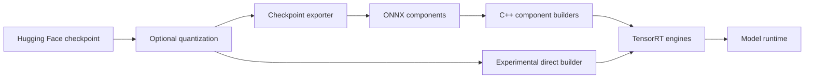

# Overview

TensorRT Edge-LLM is NVIDIA's C++ inference runtime for generative models on
NVIDIA Jetson, NVIDIA DRIVE, and NVIDIA DGX Spark. It supports text, image,
audio, speech, and action workflows while keeping the deployment runtime free
of Python dependencies.

See the [support matrix](user_guide/getting_started/support-matrix.md) for the
release software stacks and [supported models](user_guide/getting_started/supported-models.md)
for checkpoint IDs.

## Supported Platforms

TensorRT Edge-LLM officially supports NVIDIA Jetson Thor, NVIDIA DRIVE Thor,
NVIDIA DGX Spark (GB10), and NVIDIA Jetson Orin release targets. Jetson Orin
supports FP16, INT8, and INT4 runtime precisions only.

### Supported Model Families

For exact JetPack, DriveOS, CUDA, TensorRT, and TensorRT Edge-LLM version
compatibility, see the [Official Support Matrix](user_guide/getting_started/support-matrix.md).
For model and precision coverage, see [Supported Models](user_guide/getting_started/supported-models.md).

TensorRT Edge-LLM supports the deployment of a wide selection of LLM/VLM/Omni/VLA checkpoints with speculative decoding draft support, including Qwen, Llama, InternVL, Phi, Gemma, Nemotron, Alpamayo, Cosmos, etc.

---

## Key Features

- **🚀 High Performance**: Optimized CUDA kernels and TensorRT integration for minimum latency
- **💾 Memory Efficient**: Supporting 4-bit quantization for reduced memory footprint, with [FP8 KV cache](user_guide/features/FP8KV.md) support for additional memory savings
- **🔄 Production Ready**: C++-only runtime with no Python dependencies, designed for deployment on edge devices
- **🎯 Edge Optimized**: Built specifically for NVIDIA Jetson, DRIVE, and DGX Spark platforms with platform-specific optimizations
- **📊 Complete Toolkit**: End-to-end workflow from checkpoint export to C++ runtime, with engine builder and examples

## Deployment Workflows

TensorRT Edge-LLM provides two engine frontends. Both produce artifacts consumed
by the same C++ runtimes.

| Frontend | Command | Use it for |
|---|---|---|
| ONNX workflow | `tensorrt-edgellm-export`, then component C++ builders | Supported deployment path, portable intermediate artifacts, and explicit component control |
| Direct frontend | `tensorrt-edgellm-build` | Experimental on-device compilation directly from a local checkpoint |

Quantization is optional. Unquantized and supported pre-quantized checkpoints can
be compiled directly; use `tensorrt-edgellm-quantize` only to create a new
quantized checkpoint.

## Runtime Capabilities

- Paged attention, FP8 KV cache, LoRA, streaming, and [KV Cache Reuse](user_guide/features/kv-cache-reuse.md)
- EAGLE3, MTP, DFlash, and DSpark speculative decoding on supported models
- Image and audio encoders, speech generation, ASR, and action generation
- Model-specific runtimes for pipelines whose I/O contract is not LLM-shaped
- Experimental Python API and OpenAI-compatible server over the C++ runtime

Feature availability depends on the model and deployment.

## Start Here

1. [Install the Python package and C++ runtime](user_guide/getting_started/installation.md).
2. [Run the text-generation quick start](user_guide/getting_started/quick-start-guide.md).
3. Select a modality-specific workflow from the [examples](user_guide/examples/index.md).

For implementation details, see the
[checkpoint exporter](developer_guide/software-design/checkpoint-export.md),
[direct builder](developer_guide/software-design/onnxless-builder.md), and
[C++ runtime](developer_guide/software-design/cpp-runtime-overview.md) design guides.
